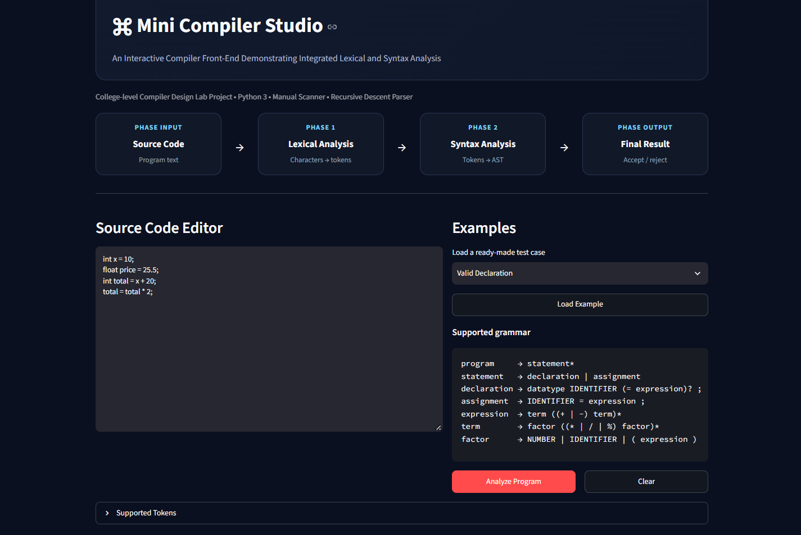
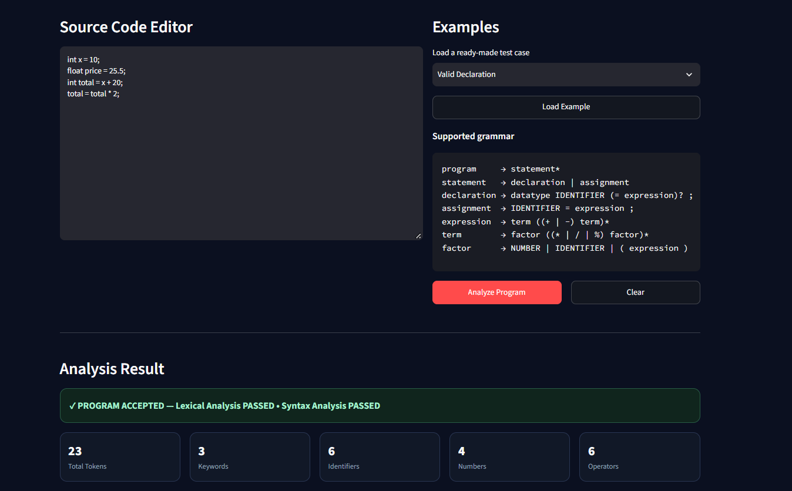
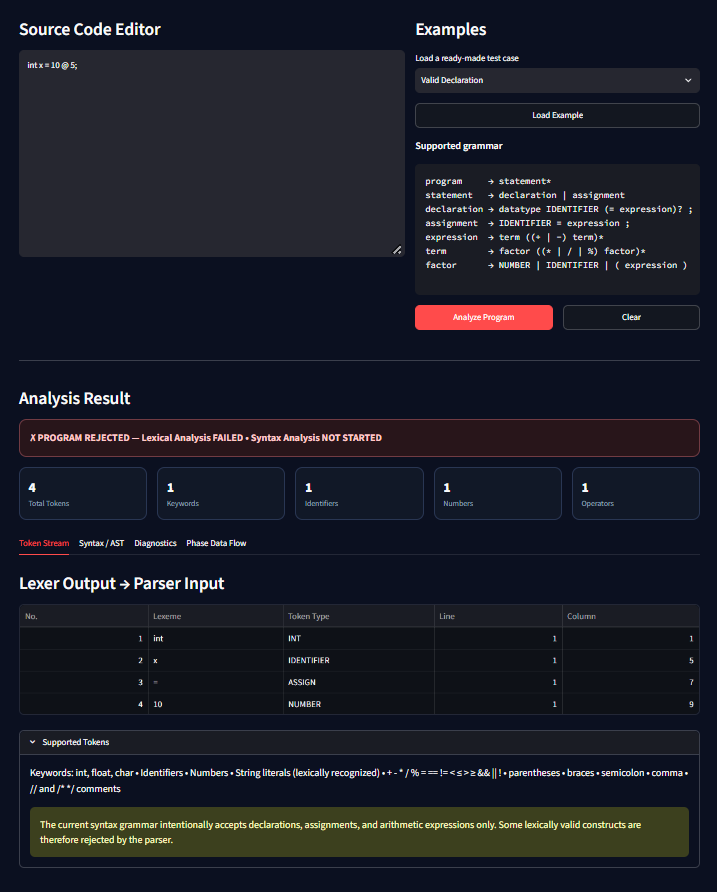

# Mini Compiler Studio

**An Interactive Compiler Front-End Demonstrating Integrated Lexical and Syntax Analysis**

## Objective

This project integrates two consecutive compiler phases:

1. Lexical Analysis
2. Syntax Analysis

The lexer is a manually written character-by-character scanner. Its output is a `List[Token]`. That exact token stream is passed to a manually written Recursive Descent Parser.

## Project Output

### Application Dashboard

The main application interface for interacting with Mini Compiler Studio and exploring its compiler front-end workflow.



*Figure 1: Application dashboard of Mini Compiler Studio.*

### Successful Compilation

This screenshot illustrates a successful compilation example within the application's interface.



*Figure 2: Successful compilation demonstration.*

### Syntax Error Handling

This screenshot demonstrates the application's interface when a syntax error is encountered during input processing.



*Figure 3: Syntax error handling demonstration.*

## Run

```bash
python -m venv .venv
```

Windows PowerShell:

```powershell
.venv\Scripts\Activate.ps1
pip install -r requirements.txt
streamlit run app.py
```

The browser will open the Streamlit application.

## Mini-language

```text
program     → statement*
statement   → declaration | assignment
declaration → datatype IDENTIFIER optional_initialization ;
optional_initialization → = expression | ε
assignment  → IDENTIFIER = expression ;
datatype    → INT | FLOAT | CHAR
expression  → term ((PLUS | MINUS) term)*
term        → factor ((MULTIPLY | DIVIDE | MODULO) factor)*
factor      → NUMBER | IDENTIFIER | LPAREN expression RPAREN
```

## Architecture

```text
Source Code
    ↓
Lexer
    ↓
Token Stream
    ↓
Parser(tokens)
    ↓
AST
    ↓
Final Result
```

`CompilerEngine` owns the orchestration. The parser never reads raw source characters.

## Important scope note

String literals and several operators are recognized by the lexer to demonstrate lexical coverage, but the small syntax grammar intentionally accepts only the constructs documented above. This keeps the project suitable for a Compiler Design Lab viva.

